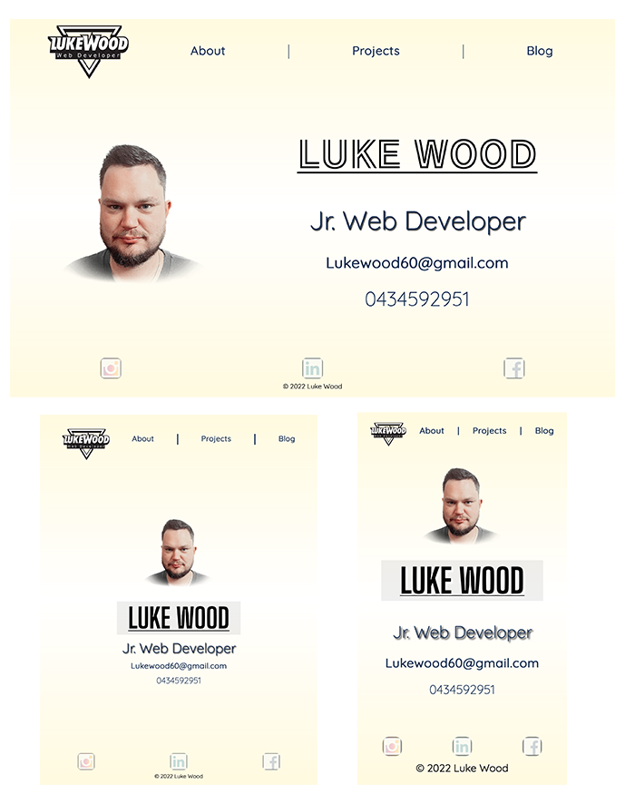

# Portfolio Documentation

## [Portfolio Website](https://lukewood-portfolio-t1a2)

## [Gitub Repository](https://github.com/luk3w00d/Portfolio)

## Purpose and target audience

The portfolio website is to demonstrate my ability to create a website with the skills learnt in the first three weeks of study at coder academy. The target audience is for possible future employees to show my web development skills.

## Function and futures

I designed the website to be simple to navigate through while still maintaining a interactive site
while still maintaining a responsive design to fit the current devices.

-Index: contains all important contact information and includes navigation to other pages as well as a self portrait.

-About: This page contains information about why i decided to make a move to web development, My previous work history with a link to my resume pdf and my hobbies which includes some explample photos.

-Project: Currently just a explample of a project layout that will be updated in the future with all my projects.

-Blog: This is a blog style page which at the top you can click the link to go to the part of the page where blog is located.

## Sitemap

## Wireframes and screenshots 

### Index Wireframe

### About Wireframe

### Projects Wireframe

### Blog wireframe

### Index screenshot

### About screenshot

### Projects screenshot

### Blog screenshot

## Tech Stack

This website was buit with the following software and websites

-Visual Studio Code: Html and scss

-Wireframe & Sitemap: [Lucid](https://www.lucidchart.com)

-Images: [Unsplash](https://www.unsplash.com)

-Editing: Photoshop

